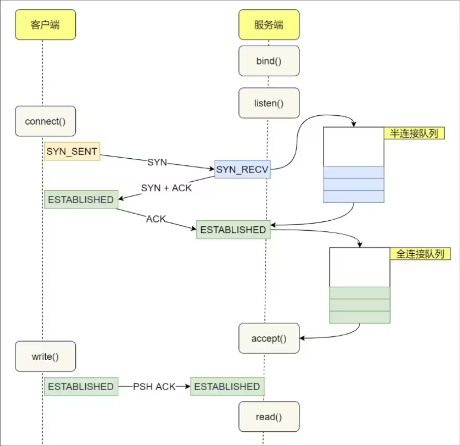

# Nginx优化

## 启用reuseport
在TCP三次握手的时候，Linux内核会维护两个队列，分别是：

1、半连接队列，也称SYN队列。

2、全连接队列，也称 accepet队列。

服务端收到客户端发起的SYN请求后，内核会把该连接存储到半连接队列，并向客户端响应SYN+ACK，接着客户端会返回ACK，服务端收到第三次握
手的ACK 后，内核会把连接从半连接队列移除，然后创建新的完全的连接，并将其添加到 accept队列，等待进程调用accept 函数时把连接取出来。


半连接队列和全连接队列都有最大长度限制，超过限制时，请求会被去弃，并返回RST

TCP全连接队列的最大值取决于min（somaxconn，backlog)。

TCP半连接队列最大值取决于max_syn_backlog、somaxconn、backlog
```
somaxconn tcp_max_syn_backlog 是 Linux 内核的参数，默认值都是 128
sysctl -w net.core.somaxconn=65530  # 设置全连接池大小
sysctl -w net.ipv4.tcp_max_syn_backlog=10240 # 设置半链接池大小
 
 
backlog 是 listen(int sockfd, int backlog) 函数中的 backlog 大小，Nginx 默认值是 511。
可以通过nginx.conf配置文件设置其长度，需重启nginx生效。
server {
  listen 80 default backlog=10240;
  servarname localhost;
  ...
} 
```
### Nginx的两种工作模式
第一种：1个master主进程+多个worker子进程（worker进程禁用reuseport模式，默认）

```
# 1、工作模式介绍（共享监听，共享一个全连接队列）
在这种方式下
（1）、主进程执行 bind() + listen() 后，创建多个子进程；
（2）、然后，在每个子进程中，都通过 accept() 或 epoll_wait() ，来处理相同的套接字。此时所有子进程/线程共享一个全连接队列
 
 
2、特点：所有worker进程共享一个listener全连接队列
 
3、优点：因为全连接队列是共享的，所以当某个worker进程繁忙的情况下，它去全连接队列里accpet的能力会降低，但其他空闲的worker进程则
不受影响，这会平衡所有worker进程的压力
 
4、缺点：多个worker进程争抢会带来额外的损耗
```
第二种：1个master主进程+多个worker子进程(worker进程启用reuseport模式）

```
1、工作模式介绍（单独监听，独享自己的全连接队列）
在这种方式下，需要开启 SO_REUSEPORT 选项，所有的worker进程会都监听相同的接口。
然后由内核负责将请求负载均衡到这些监听进程中去，相当于每个进程/线程独享自己的那一个 listener 的全链接队列，
 
 
2、特点：每个worker进程都独享自己的listener全连接队列
 
3、优点：
不需要多个进程/线程竞争某个公共资源，减少竞争的资源消耗，处理效率自然提高了。
 
4、缺点：
独享可以减少竞争，但会造成分配不均衡，因为每个worker自己listener管理的全连接队列无法分享给别的worker进程，你就无法做到
在你自己的worker繁忙的情况下，让其他空闲的worker进程来accpet()访问你的全连接队列从而分摊你的压力，这会导致单个链接的请求的延迟增大，cpu分配不均匀
```


修改参数如下，只需要在listen 端口后面加上reuseport即可：

```
server {
        listen 80 reuseport;
        listen 443 ssl http2 reuseport;
        server_name   xxx.xxx.com;
        charset utf-8;
```
## CPU亲和
### worker_cpu_affinity的指令介绍

Nginx提供了一种名为worker_cpu_affinity的指令，可以让你指定Nginxworker进程与特定CPU核心之间的亲和性，也就是把某个或某些worker进程
绑定到具体的CPU 核心上运行。通过设置CPU亲和性，你可I以提高Nginx的性能，因为当进程始终在同一个CPU 核心上执行时，可I以利用CPU的缓存，
从而减少内存访问延迟。
下面是一些用法示例：

1、绑定每一个 worker进程到一个具体的 CPU 核心:
```
# 示例1、如果有个4核
worker_processes  4;
worker_cpu_affinity 0001 0010 0100 1000; # 4个核心，就用4位bit，哪一位为1则代表用第几颗
===
# 示例2、如果有16核
worker_processes    16;
worker_cpu_affinity 0000000000000001 0000000000000010 0000000000000100 0000000000001000 ...;
```
上述示例1中，worker_processes表示总共有4个worker进程，每行的worker_cpu_affinity分别对应一个二进制数，用来表示该worker进程应被
绑定到哪个CPU核心上。这种配置方式在你精确知道服务器有多少CPU核心，并且希望将进程直接绑定到特定核心上时非常有用。

2、自动分配worker进程到所有可用的CPU核心：
```
worker_processes  auto;
worker_cpu_affinity auto;
```
以上配置将会自动检测你的机器有多少个CPU核心，并尝试将每个worker进程绑定到一个独立的CPU核心上。这种配置方式在你不确定服务器具体
有多少CPU核心，或者不希望手动指定进程绑定的核心时非常有用。
设置 CPU 亲和性后，worker 进程在运行时将始终在同一个 CPU 核心上执行，从而更有效地利用 CPU 的缓存，减少内存访问延迟，提高整体性能。
但也需要注意，如果服务器同时运行着其他CPU密集型任务，设置CPU亲和性可能并不能产生显著的性能提升，甚至可能会降低性能，因为这可能导
致 CPU 核心的过度使用。
在实际应用中，你可能需要根据你的服务器的特定情况进行调整和优化。
### 案例
查看当没有指定cpu的时候，每个worker进程都跑在哪些cpu上
```
[root@lb ~]# cat /etc/nginx/nginx.conf |grep -i work
worker_processes 2;
[root@lb ~]#  ps -eo pid,args,psr | grep [n]ginx
   6989 nginx: master process /usr/   1
   6990 nginx: worker process         0 # 第一颗
   6991 nginx: worker process         1 # 第二颗
补充说明：命令ps -eo pid,args,psr 是用来显示进程ID（pid）、命令行参数（args）以及进程运行的处理器ID（psr）。
```
## Nginx通用优化文件
```
[root@nginx ~]# cat nginx.conf
user www;                                   #nginx启动用户
worker_processes auto;                       #nginx工作进程数
worker_cpu_affinity auto;                     #开启CPU亲和
error_log /var/log/nginx/error.log warn;      #错误日志，存放路径，记录日志的级别
pid /run/nginx.pid;                         #指定pid文件位置
worker_rlimit_nofile 35535;                  #指定nginx服务的最大打开文件数
 
events {
    use epoll;                              #使用epoll网络模型
    worker_connections 10240;                #worker工作进程的最大连接数
}
 
http {
    include             mime.types;                #nginx能识别的文件类型
    default_type        application/octet-stream;   #nginx不识别的文件类型默认下载
    charset utf-8;                               #指定字符集
 
    log_format  main  '$remote_addr - $remote_user [$time_local] "$request" '
                      '$status $body_bytes_sent "$http_referer" '
                      '"$http_user_agent" "$http_x_forwarded_for"';           #配置日志格式
 
    access_log  /var/log/nginx/access.log  main     #指定访问日志路径，调用日志的格式
    server_tokens off;                            #隐藏版本号
    client_max_body_size 200m;                     #上传文件大小限制
    sendfile            on;                        #高效读取
    tcp_nopush          on;                         #高效传输
    #tcp_nodelay         on;                        #实时传输
    keepalive_timeout   65;                         #开启长连接
    gzip on;                                      #开启压缩
    gzip_disable "MSIE [1-6]\.";                  #指定不压缩的浏览器
    gzip_http_version 1.1;                          #压缩后传输的协议
    gzip_comp_level 4;                              #压缩的级别
    gzip_buffers 16 8k;                             #压缩缓存
    gzip_min_length 1024;                           #开启压缩的最小值
    gzip_types text/plain text/css application/json application/x-javascript text/xml application/xml application/xml+rss text/javascript image/jpeg;       #压缩的文件类型
    include /etc/nginx/conf.d/*.conf;               #包含的配置文件
}
```

## nginx优化总结
```
1、CPU亲和、worker进程数、调整nginx进程打开的文件句柄数
2、使用Epool网络模型、调整每个worker进程的最大连接数
3、文件的高效读取sendfile、nopush
4、文件的传输实时性、nodealy
5、开启tcp长连接，以及长连接超时时间keepalive_timeout
6、开启文件传输压缩gzip
7、开启静态文件expires缓存
8、隐藏nginx版本号
9、禁止通过ip地址访问，禁止恶意域名解析，只允许域名访问
10、配置防盗链、以及跨域访问
11、防DDOS、cc攻击，限制单IP并发连接，以及http请求
12、优雅显示nginx错误页面
13、nginx加密传输https优化
14、nginx proxy_cache、fastcgi_cache、uwsgi_cache 代理缓存，第三方工具（squid、varnish）
```

